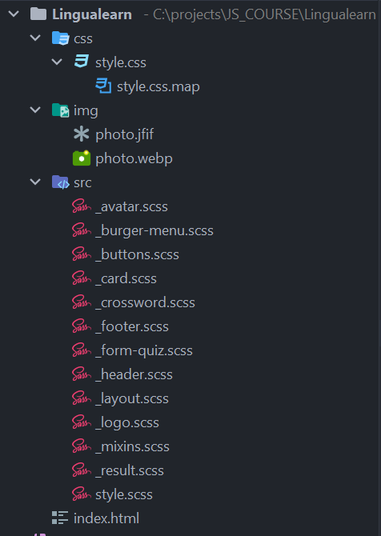
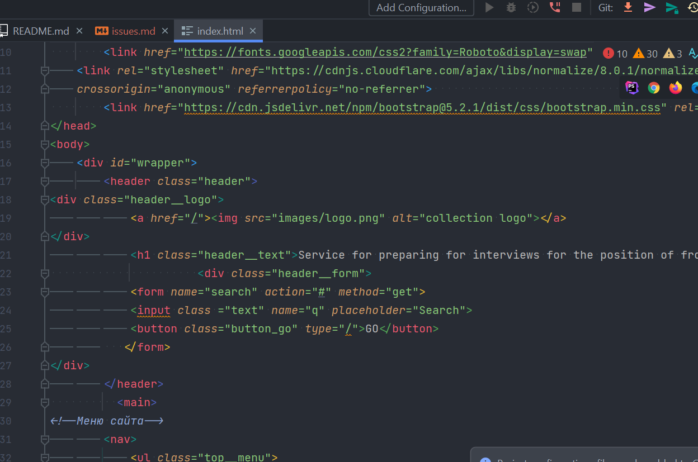
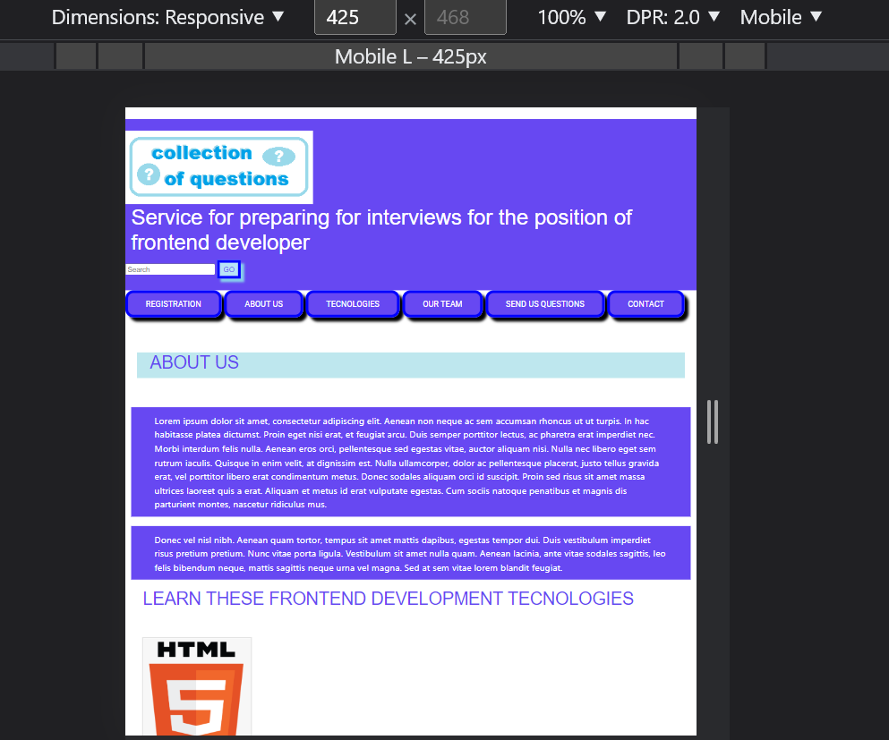

1. Структура проекта плохая, не нужно всё хранить в корне проекта + почему-то в sass файле хранится почему-то всё что
   можно.
   Вот пример хорошей структуры . Если у тебя много html файлов, то надо вынести их папку, которую
   можно назвать pages например
2. Что директория sass? Если в ней должны храниться стили, то нужно называть styles без привязки к какому либо инструменту
3. Не надо называть файлы/переменные/классы и тп, транслитом (как например "adminka"). Только чистый английски
4. Не надо называть файлы index2.html и тп, каждый файл должен именть уникальное название и не нужно делать его
   уникальным просто добавляя цифру.
5. Названия файлов должны быть в kebab-case.
6. Форматирование кода плохое . Тут очень тяжело разобрать что и куда. У каждой IDE есть набор
   клавиш, который автоматически форматирует код (насколько это возможно), погугли
7. Адаптивности нет совсем 
8. 
